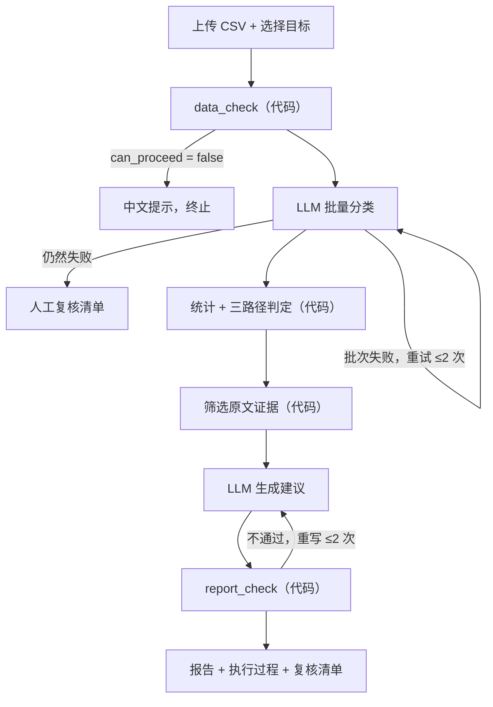

# UserEcho PRD v1.3（MVP 定稿）

> 唯一有效版本。原则：**做深，不做宽**。凡是不能直接增强 Demo、评测结果或面试表达的功能，一律放进第 13 节的「后续清单」。

## 1. 定位

UserEcho 是一个受约束的 AI 用户反馈分析工作流，不是完全自主的 Agent。分工如下：

- **LLM** 负责两件事：语义分类、生成建议。
- **代码** 负责四件事：统计、打分、证据关联、规则校验。

目标用户是用户运营和产品经理。上传香氛类产品的用户反馈后，系统输出一份报告，包含问题优先级、风险警报、原文证据和行动建议。

面试时要讲清楚四点：
1. **真实问题**：人工整理反馈很耗时，而且结论容易脱离用户原话。
2. **合理分工**：LLM 做语义理解，代码做统计和校验。
3. **风险控制**：低频的安全问题不会因为数量少而被忽略。
4. **效果验证**：在独立的人工标注数据上测量效果。

## 2. 输入

- **CSV 文件**
  - 必填字段：`feedback_id`、`feedback_text`
  - 选填字段：`rating`（1–5）、`date`、`channel`、`respondent_id`
- **分析目标**：页面下拉选择，不调用 LLM 理解。可选值：`satisfaction`（满意度分析）、`complaints`（主要抱怨）、`repurchase`（复购相关）

## 3. 分类规范（同时作为人工标注规范）

### 3.1 主题表（`config/taxonomy.yaml`）

| code | 主题 | 边界 |
|---|---|---|
| scent_mismatch | 香味与描述不符 | 实际气味与商品描述或宣传明显不一致 |
| scent_preference | 个人香味偏好 | 喜欢或不喜欢这个味道，但没有指出与描述不符 |
| longevity_diffusion | 留香与扩香效果 | 留香短、扩香弱、过淡或过浓 |
| packaging_leak | 包装破损或漏液 | |
| safety_discomfort | 使用安全与身体不适 | 头晕、过敏、刺激；儿童或宠物安全顾虑 |
| price_value | 价格与性价比 | |
| logistics | 物流与配送 | |
| appearance_usage | 外观与使用体验 | 瓶身设计、扩香器具、操作是否方便 |
| service | 客服与售后 | |
| other | 其他或无法判断 | 去掉空格后少于 4 个字的反馈，一律归入此类 |

### 3.2 标注字段

- **多标签**：每条反馈最多 3 个主题，同一主题只出现一次。
- **每个主题单独标注**：
  - `sentiment` 取值：`positive` / `negative` / `neutral` / `mixed`
  - `mixed` 只用于**同一主题内部**同时出现明显正负评价的情况，例如「前调好闻，后调刺鼻」。语气复杂但评价方向明确的，不标 `mixed`。
  - `severity`：仅当 sentiment 为 `negative` 或 `mixed` 时标注 1–3；`positive` 和 `neutral` 为 `null`。
    - 1 = 轻微不满
    - 2 = 体验明显受损
    - 3 = 无法使用，或涉及安全、健康、财产损失
- **整条反馈的复购信号** `repurchase_signal`，取值：
  - `positive`：会回购或推荐
  - `negative`：不会回购
  - `conditional`：有条件回购，例如「便宜点会回购」
  - `none`：没有提及

## 4. 工作流



## 5. data_check 规则

| 检查项 | 处理方式 |
|---|---|
| 编码 | 依次尝试 `utf-8-sig`、`gbk`；都失败时返回中文错误，页面不能崩溃 |
| 缺少必填列 | `can_proceed = false` |
| 空文本（null、空字符串、纯空格） | 计入 `empty_text_count`，从样本中排除 |
| 重复 `feedback_id` | 保留第一条，其余计入 `duplicate_id_count` 并给出警告 |
| 文本完全相同但 ID 不同 | 计入 `duplicate_text_count`，**只提示，不删除**（短好评重复出现是正常现象） |
| 短文本（去空格后少于 4 个字） | 计入 `short_text_count`，保留在样本中 |
| rating 不在 1–5 之间，或不是数字 | 计入 `invalid_rating_count`，不参与评分统计，任务不中断 |
| 有效反馈为 0 | `can_proceed = false` |
| 有效反馈 1–4 条 | 只展示数据概览，不做优先级排序 |
| 有效反馈 5–29 条 | 正常运行，但强制显示「小样本，仅供探索」 |
| 有效反馈 ≥ 30 条 | 正常分析 |
| 有效反馈 > 200 条 | 只处理前 200 条，并给出提示 |

输出字段：`sample_size`、`valid_count`、`missing_fields`、`empty_text_count`、`duplicate_id_count`、`duplicate_text_count`、`short_text_count`、`invalid_rating_count`、`rating_distribution`、`sample_level`（none / overview_only / exploratory / normal）、`warnings[]`、`can_proceed`

## 6. 优先级与三路径

**计入打分的提及**：只计 sentiment 为 `negative` 或 `mixed` 的提及。`positive` 和 `neutral` 只做描述性统计。

对每个主题，按「负向提及数」分三条路径：

| 条件 | 路径 | 输出 |
|---|---|---|
| 负向提及 ≥ 2 | **优先级排序** | 计算 P0–P3 |
| 负向提及 < 2，但主题为 safety_discomfort 或存在 severity = 3 | **风险警报** | risk_alert，并进入人工复核 |
| 负向提及 < 2，且风险不高 | **证据不足** | 列入报告，但不排序 |

**打分公式**（仅用于优先级排序路径）：

```
F = 负向提及数 ÷ 有效反馈数：≥15% → 3；5% ≤ share < 15% → 2；<5% → 1
S = 该主题负向提及的 severity 中位数，向上取整（偏保守，便于识别风险）
I = 查 config/impact.yaml（按 goal_type 人工设定，写进 decision_log）
基础分 = F + S + I（3–9）→ P0 ≥ 8 ｜ P1 6–7 ｜ P2 4–5 ｜ P3 = 3
```

**强制规则**（仅适用于优先级排序路径，报告里要写明触发了哪一条）：
- safety_discomfort → 最低 P1，同时生成 risk_alert
- 存在 severity = 3 的提及 → 最低 P1
- scent_preference → 最高 P2

报告里要展示打分过程，例如：`F2 + S3 + I3 = 8 → P0`。

## 7. 限额

- 单次最多处理 200 条反馈
- 分类每批 25 条
- 每批失败最多重试 2 次；仍失败的条目进入人工复核清单
- 整个任务最多调用 LLM 15 次；达到上限立即停止，并如实报告已完成的部分
- 记录实际 token 用量和耗时（不做运行前预估）

## 8. report_check（代码）

1. 报告中引用的 feedback_id 必须存在，且确实带有对应的主题标签。
2. 报告中的数字必须与统计结果一致。
3. 有效反馈少于 30 条时，必须包含小样本提示。
4. 检测因果词（「导致」「造成」「使……流失」等）。数据中没有行为数据时，这类表述判定为不通过。
5. 每个 P0 或 P1 问题至少要有 2 条证据。

## 9. 报告结构

1. 数据概览
2. 问题优先级表（含打分过程）
3. 风险警报（含「仅用于反馈识别，需人工核实」提示）
4. 用户证据（每个问题附 2–3 条原话和 feedback_id）
5. 行动建议（分产品侧和运营侧）
6. 复购信号分布
7. 局限说明
8. 人工复核清单

页脚固定显示：「本工具不提供医疗诊断或健康建议。」

## 10. 数据与评测

| 数据集 | 数量 | 来源 | 用途 |
|---|---|---|---|
| dev | 50–80 条 | 自采问卷为主，可加少量 AI 生成的样本（需标注来源） | 调试 prompt、修订主题表 |
| eval | 40–50 条 | **只用真实匿名问卷** | 最终评测 |
| edge | 10–15 条 | 人工构造 | 测试异常输入 |

- 访谈材料只用于确定主题体系，不进入 dev 或 eval。
- 按 `respondent_id` 划分数据集：同一个人的反馈不能同时出现在 dev 和 eval 中。
- 开发步骤 1–7 期间不查看 eval 原文，也不在 eval 上运行系统。
- eval 必须**先人工标注完毕**，才能运行系统。
- 原始问卷放在 `data/raw/`，不提交到 git，也不放进公开仓库。

**评测指标（4 项）**：
1. Topic micro-F1
2. High-risk Recall：人工标为 safety_discomfort 或 severity = 3 的反馈，系统识别出来的比例
3. Evidence Support Rate：带有正确引用的结论数 ÷ 结论总数
4. 处理时间：人工 vs 系统

**附加检查**：隔一周重新标注 15–20 条，计算自我一致率。

**如实报告**：评测数据不足 50 条时，按实际条数报告，并注明「仅用于验证工作流可行性」。

## 11. 技术栈

Python 3.11+ ｜ Streamlit ｜ pandas ｜ OpenAI 兼容 SDK（环境变量 `LLM_API_KEY` / `LLM_BASE_URL` / `LLM_MODEL`）｜ pydantic ｜ pytest

## 12. 完成标准（达到后停止开发，转入简历包装）

- [ ] 能读取中文 CSV（包括 GBK 编码）
- [ ] 能完成主题、情绪、严重度分类
- [ ] 能输出优先级、风险警报、原文证据
- [ ] 能生成产品侧和运营侧建议
- [ ] 有 ≥ 40 条独立人工标注的评测数据
- [ ] 有真实测得的 F1、风险召回、证据支持率、处理时间
- [ ] 记录了 5–10 个 Bad Case 及改进过程
- [ ] 有 README、截图、2–3 分钟演示视频，线上可访问

## 13. 后续清单（不属于 MVP）

评测集 checksum 与 Git 标签｜双人标注与 Cohen's kappa｜置信区间｜多来源分层评测｜运行前 token 预估｜完整访谈稿处理｜自然语言目标理解｜多 Agent｜爬虫｜数据库与账号系统

## 14. 开发顺序与时间

| 周 | 开发 | 数据 |
|---|---|---|
| 第 1 周 | ① CSV 上传 + data_check + 测试 ② 主题表和 impact 配置 | 问卷发出；从访谈材料中整理主题示例 |
| 第 2 周 | ③ LLM 封装 + 分类（用 dev 数据调试）④ 统计 + 三路径 + 证据 | 回收问卷；按人划分数据集；**标注 eval** |
| 第 3 周 | ⑤ 建议生成 + report_check ⑥ 执行过程展示 ⑦ 部署 | ⑧ 在 eval 上跑评测 |
| 第 4 周 | 只修复问题，不加新功能 | Bad Case、README、视频、简历 |

## 变更记录

| 版本 | 要点 |
|---|---|
| v1.1 | 新增分类步骤、固定主题表、证据由代码筛选 |
| v1.2 | 改为加法打分 + 强制规则；多标签，情绪按主题标注；香味拆成两个主题；复购信号独立成字段 |
| v1.3 | 按 MVP 收缩范围：分析目标改为下拉选择；补全 sentiment 和 repurchase 的枚举值；定义三路径；补全 data_check 规则；评测指标减为 4 项；数据量下调；访谈材料只用于设计主题；复杂功能移入后续清单 |
