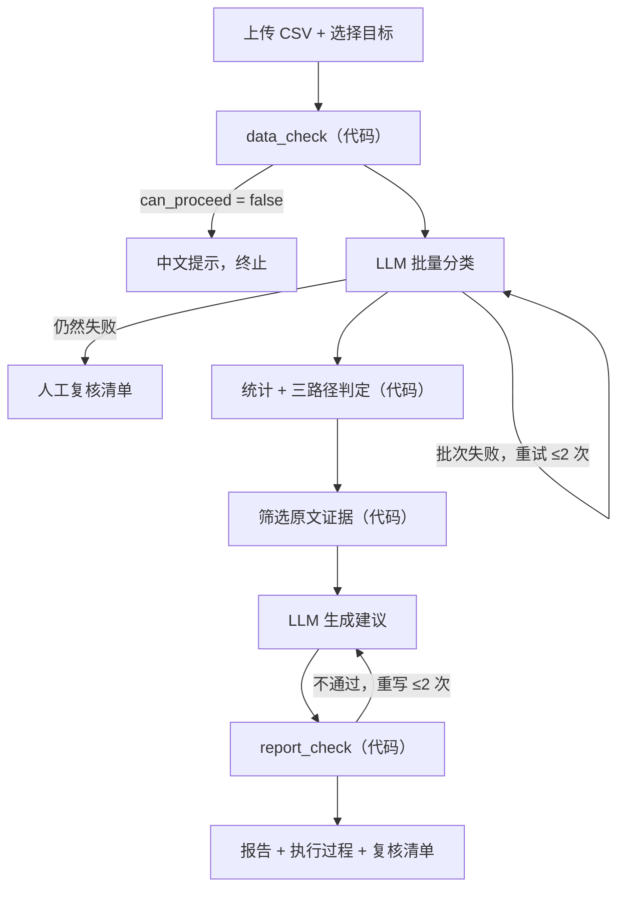

# UserEcho PRD v1.3（MVP 定稿）

> 唯一有效版本。原则：**做深，不做宽**。凡是不能直接增强 Demo、评测结果或面试表达的功能，一律放进第 13 节的「后续清单」。

## 1. 定位

UserEcho 是一个受约束的 AI 用户反馈分析工作流，不是完全自主的 Agent。分工如下：

- **LLM** 负责两件事：语义分类、生成建议。
- **代码** 负责四件事：统计、打分、证据关联、规则校验。

目标用户是用户运营和产品经理。上传香氛类产品的用户反馈后，系统输出一份报告，包含问题优先级、风险警报、原文证据和行动建议。

面试时要讲清楚四点：
1. **真实问题**：人工整理反馈很耗时，而且结论容易脱离用户原话。
2. **合理分工**：LLM 做语义理解，代码做统计和校验。
3. **风险控制**：低频的安全问题不会因为数量少而被忽略。
4. **效果验证**：在独立的人工标注数据上测量效果。

## 2. 输入

- **CSV 文件**
  - 必填字段：`feedback_id`、`feedback_text`
  - 选填字段：`rating`（1–5）、`date`、`channel`、`respondent_id`
- **分析目标**：页面下拉选择，不调用 LLM 理解。可选值：`satisfaction`（满意度分析）、`complaints`（主要抱怨）、`repurchase`（复购相关）

## 3. 分类规范（同时作为人工标注规范）

### 3.1 主题表（`config/taxonomy.yaml`）

| code | 主题 | 边界 |
|---|---|---|
| scent_mismatch | 香味与描述不符 | 实际气味与商品描述或宣传明显不一致 |
| scent_preference | 个人香味偏好 | 喜欢或不喜欢这个味道，但没有指出与描述不符 |
| longevity_diffusion | 留香与扩香效果 | 留香短、扩香弱、过淡或过浓 |
| packaging_leak | 包装破损或漏液 | |
| safety_discomfort | 使用安全与身体不适 | 头晕、过敏、刺激；儿童或宠物安全顾虑 |
| price_value | 价格与性价比 | |
| logistics | 物流与配送 | |
| appearance_usage | 外观与使用体验 | 瓶身设计、扩香器具、操作是否方便 |
| service | 客服与售后 | |
| other | 其他或无法判断 | 去掉空格后少于 4 个字的反馈，一律归入此类 |

主题表字段经项目负责人确认后固定如下，仅统一字段契约，不改变现有主题定义或业务边界。`topics` 以本节规定的 10 个唯一 code 为键，不允许新增表外 code，`other` 恰好存在一个。

| 字段 | 类型 | 含义 |
|---|---|---|
| name_zh | 字符串 | 中文主题名称 |
| definition | 字符串 | 主题定义 |
| include | 字符串列表 | 纳入该主题的情况 |
| exclude | 字符串列表 | 排除或应归入其他主题的情况 |
| confused_with | 字符串列表 | 容易混淆的相邻主题，只能引用现有主题 code，且不得引用自身 |

每个主题固定包含上述五个字段。标注指南末尾未决边界仍需项目负责人确认；本次已确认的复购、浓淡与偏好、中性安全咨询规则如下，其余未决边界不作裁定。

太淡、太浓、扩散范围属于 `longevity_diffusion`；仅表达不喜欢气味属于 `scent_preference`。同一反馈可以同时包含两个主题，各自须有文本依据。`safety_discomfort` 包含已经发生的身体症状，以及明确的儿童或宠物安全顾虑；售前或使用前的儿童、宠物安全咨询归入 `safety_discomfort / neutral / null`，该提及不触发 `risk_alert`。

只有涉及官方页面、商家描述或明确宣传承诺与实际气味不符，才标 `scent_mismatch`；试香纸、皮肤、衣物等不同载体上的主观气味差异，在没有官方宣传对照时暂归 `scent_preference`。

### 3.2 标注字段

- **多标签**：最终每条反馈最多 3 个主题，同一主题只出现一次；原始候选提及按第 3.3 节去重。不存在通用的“缺陷优先单主标签”规则，不新增 `main_topic` 或 defect-first 规则；跨主题时每个主题分别标 sentiment 和 severity。
- 多标签按文本首次出现顺序保存；评测按 topic code 的无序集合匹配，不按 topic_1/topic_2/topic_3 的位置比较。
- **每个主题单独标注**：
  - `sentiment` 取值：`positive` / `negative` / `neutral` / `mixed`
  - `mixed` 只用于**同一主题内部**同时出现明显正负评价的情况，例如「前调好闻，后调刺鼻」。语气复杂但评价方向明确的，不标 `mixed`。
  - `severity`：仅当 sentiment 为 `negative` 或 `mixed` 时标注 1–3；`positive` 和 `neutral` 为 `null`。
    - 1 = 轻微主观不悦，如口味不喜欢
    - 2 = 阻碍使用或购买，如漏液、明显贵但买了；条件已经阻止当前购买或复购时，价格问题通常为 2
    - 3 = 仅用于明确身体不适或安全风险；仅无法使用或财产损失不再单独作为 3 的依据
- **整条反馈的复购信号** `repurchase_signal`，取值：
  - `positive`：明确会回购或再次购买
  - `negative`：明确不会再买
  - `conditional`：明确在某个条件满足后才考虑再次购买
  - `none`：未明确表达再次购买意图

**复购信号硬规则**：只能依据用户明确表达的再次购买意图判断，不得从满意、不满、评分、换货结果、情绪或 severity 推测；仅推荐他人而没有表达自己再次购买意图时为 `none`。

“不敢再用、不敢再点、停止使用”不能自动推导为复购 negative；只有明确提到不买、不回购、不下单等购买意愿，才能标 negative。

人工标注 CSV 保留三组字段 `topic_1/sentiment_1/severity_1`、`topic_2/sentiment_2/severity_2`、`topic_3/sentiment_3/severity_3`；不足三主题时未使用组保持为空。标注字段中的文本 `null` 读取后必须标准化为 Python `None`，后续 Pydantic/JSON 使用真正的 null，不得输出字符串 "null"；不对反馈原文字面文本作此转换。完整表头及校准裁决见标注指南；分类运行时的来源字段与处理规则见第 3.3 节。

### 3.3 主题提及来源与确定性后处理（负责人批准）

`TopicAnnotation` 新增必填 `source_span: str` 与 `mention_type: asserted / uncertain / consultation`。
`source_span` 是支持该主题的连续反馈原文片段，必须逐字复制，包括标点符号和空格，不改写、不补省略号、不修正错别字。去除首尾空白后须非空且在对应 `feedback_text` 中精确找到；不做模糊匹配或内部空白、标点归一化。

- asserted：明确陈述的体验、事实或评价。
- uncertain：猜测、可能性、备选原因或无法确认的判断。
- consultation：尚未发生体验的售前或使用前咨询。

严格处理顺序：① Pydantic 结构校验；② 所有候选 source_span 原文子串校验；③ 同主题去重；④ mention_type 过滤和转换；⑤ 对可信主题执行最多三个主题的 select_topics；⑥ 最终 sentiment/severity 约束；⑦ 后续 risk_alert 等派生。未通过证据过滤的主题不占名额。本阶段不新增风险计算代码。

原始候选结构最多 10 项，允许同一 code 的不同提及；最终输出仍为 1–3 个唯一主题。候选结构先检查类型和枚举，情绪与严重度的组合约束留到转换、裁剪后验证，确保咨询可被强制改为 neutral/null。

| 候选情况 | 确定性处理 |
|---|---|
| asserted | 正常保留 |
| 同主题 asserted 与 uncertain | 保留 asserted，删除 uncertain，记录 dropped_uncertain_duplicate |
| uncertain 与其他可信主题并存 | 删除 uncertain，记录 dropped_uncertain_topic；不将猜测变成最终主题 |
| 全部候选均为 uncertain | 整条进入 review_items，reason=uncertain_only_requires_review，不重试 |
| 任一 source_span 非原文子串或空白 | 整条进入 review_items，reason=source_span_not_in_feedback，不重试；即使该候选随后本会被删除也先校验 |
| safety_discomfort 的 consultation（含儿童、孕妇、宠物中性咨询） | 保留，强制 neutral/null，该提及不触发 risk_alert |
| 非安全 consultation | 有其他可信主题则删除；过滤后无主题则转换为 other/neutral/null，保留 consultation 类型及原始证据，不复核、不重试 |

删除与转换事件在 `provenance_events` 返回，仅含 feedback_id、code、reason，不含原文；额外事件为 dropped_duplicate_topic、dropped_non_safety_consultation、converted_consultation_to_other。

仅网络/API 临时错误、JSON 解析失败、Pydantic 校验失败、返回结构缺失或损坏可重试。HTTP 408/409/429/5xx 为临时状态；其余 API 状态不自动重试。语义过滤及复核条目不消耗重试，其余反馈的重试请求排除已进入语义复核的条目。每批仍最多两次重试、全局最多 15 次调用，temperature=0 不变。

Prompt 要求逐条独立提取候选、原文证据、mention_type、sentiment/severity 及既有复购字段，不使用同批其他反馈作为依据；不得要求模型自行删 uncertain。复购与风险规则不变。候选选择与提及类型仍由模型产生，原文子串存在仅证明引用真实，不证明主题或 mention_type 判断必然正确。

## 4. 工作流


```mermaid
flowchart TD
    A["上传 CSV + 选择目标"] --> B["data_check（代码）"]
    B -->|can_proceed = false| X["中文提示，终止"]
    B --> C["LLM 批量分类"]
    C -->|批次失败，重试 ≤2 次| C
    C -->|仍然失败| H["人工复核清单"]
    C --> D["统计 + 三路径判定（代码）"]
    D --> E["筛选原文证据（代码）"]
    E --> F["LLM 生成建议"]
    F --> G["report_check（代码）"]
    G -->|不通过，重写 ≤2 次| F
    G --> R["报告 + 执行过程 + 复核清单"]
```

## 5. data_check 规则

| 检查项 | 处理方式 |
|---|---|
| 编码 | 依次尝试 `utf-8-sig`、`gb18030`；都失败时返回中文错误，页面不能崩溃 |
| 缺少必填列 | `can_proceed = false` |
| 空 `feedback_id`（缺失、空字符串或纯空白） | 计入 `empty_id_count`，视为无效行并排除 |
| 空文本（CSV 真正缺失的单元格、空字符串、纯空白） | 计入 `empty_text_count`，从样本中排除；字面字符串「NA」「NULL」视为普通用户文本，不自动删除 |
| 重复 `feedback_id` | 保留第一条，其余计入 `duplicate_id_count` 并给出警告 |
| 文本完全相同但 ID 不同 | 计入 `duplicate_text_count`，**只提示，不删除**（短好评重复出现是正常现象） |
| 短文本（去空格后少于 4 个字） | 计入 `short_text_count`，保留在样本中 |
| rating 不在 1–5 之间，或不是数字 | 计入 `invalid_rating_count`，不参与评分统计，任务不中断 |
| 有效反馈为 0 | `analysis_mode = blocked`，`can_proceed = false` |
| 有效反馈 1–4 条 | `analysis_mode = summary_only`，只展示数据概览，不做优先级排序 |
| 有效反馈 5–29 条 | `analysis_mode = exploratory`，正常运行，但强制显示「小样本，仅供探索」 |
| 有效反馈 ≥ 30 条 | `analysis_mode = standard`，正常分析 |
| 清洗后有效反馈 > 200 条 | 仅将前 200 条放入返回的 `cleaned_df`；必须以中文警告说明清洗后有效总数、本次实际处理 200 条、未处理数量，以及只取前 200 条可能受到原始排序影响，禁止静默截断 |

输入为 CSV 原始字节，输出为 `cleaned_df` 和结构化 `report`。完整读取 CSV 后，先按 `feedback_id` 保留第一条，再排除空 ID，最后排除空文本；完成全量清洗后，按原始顺序保留最多 200 条。

`report` 输出字段：`raw_sample_size`、`valid_sample_size`、`missing_fields`、`empty_id_count`、`empty_text_count`、`duplicate_id_count`、`duplicate_text_count`、`short_text_count`、`invalid_rating_count`、`rating_distribution`、`analysis_mode`（blocked / summary_only / exploratory / standard）、`warnings[]`、`errors[]`、`can_proceed`。

- `raw_sample_size`：成功解析的 CSV 原始数据行数，不含表头；无法解析时为 0。
- `valid_sample_size`：最终实际返回给后续流程的 `cleaned_df` 行数，最大为 200。截断前有效总数和未处理数量另写入警告，不作为后续统计分母。
- ID 去重、空 ID、空文本的排除计数按上述顺序覆盖全量数据，各阶段只统计当时仍保留的行。
- 重复文本、短文本、无效评分及评分分布基于最终返回的 `cleaned_df`；无效评分置为空值，不参与评分统计，反馈本身保留。
- `analysis_mode` 根据 `valid_sample_size` 判定；文件为空、解码或解析失败、缺少必填字段、有效反馈为 0 时为 `blocked`，且 `can_proceed = false`，`errors[]` 提供中文错误；其他模式为 `can_proceed = true`。

## 6. 优先级与三路径

**计入打分的提及**：只计 sentiment 为 `negative` 或 `mixed` 的提及。`positive` 和 `neutral` 只做描述性统计。

**独立风险标志**：`risk_alert` 由后续代码根据主题、sentiment 和 severity 派生，不作为人工标注字段。`risk_alert` 不是 P0–P3 优先级，也不替代优先级。对每个主题，只要存在任意 sentiment 为 `negative` / `mixed` 的 `safety_discomfort` 提及，或任意 `severity = 3` 的提及，均设置 `risk_alert=true`，不受负向提及数门槛限制。未满足上述高风险条件时，不生成风险警报。

对每个主题，按「负向提及数」及上述高风险条件分三条路径：

| 条件 | 路径 | 输出 |
|---|---|---|
| 负向提及 ≥ 2 | **优先级排序** | 正常计算 P0–P3；满足上述高风险条件时，同时设置 `risk_alert=true` |
| 负向提及 < 2，且满足上述高风险条件 | **风险警报** | 不计算 P0–P3，只生成 `risk_alert=true` 并进入人工复核 |
| 负向提及 < 2，且不满足上述高风险条件 | **证据不足** | 不计算 P0–P3、不生成 `risk_alert`，只标记 `insufficient_evidence`，列入报告但不排序 |

**打分公式**（仅用于优先级排序路径）：

```
F = 负向提及数 ÷ 有效反馈数：≥15% → 3；5% ≤ share < 15% → 2；<5% → 1
S = 该主题 negative/mixed 提及的 severity 中位数，小数向下取整（2026-09-26 负责人批准）
I = 查 config/impact.yaml（按 goal_type 人工设定，写进 decision_log）
基础分 = F + S + I（3–9）→ P0 ≥ 8 ｜ P1 6–7 ｜ P2 4–5 ｜ P3 = 3
```

**强制规则**（仅适用于优先级排序路径，报告里要写明触发了哪一条）：
- safety_discomfort → 最低 P1（`risk_alert` 按上述独立风险规则生成）
- 存在 severity = 3 的提及 → 最低 P1（同时按上述独立风险规则设置 `risk_alert=true`）
- scent_preference → 最高 P2

报告里要展示打分过程，例如：`F2 + S3 + I3 = 8 → P0`。

## 7. 限额

- 完整读取并清洗上传 CSV，单次只向后续流程返回前 200 条有效反馈；超出部分必须按第 5 节显示中文截断警告
- 分类每批 25 条
- 每批失败最多重试 2 次；仍失败的条目进入人工复核清单
- 整个任务最多调用 LLM 15 次；达到上限立即停止，并如实报告已完成的部分
- 记录实际 token 用量和耗时（不做运行前预估）

## 8. report_check（代码）

1. 报告中引用的 feedback_id 必须存在，且确实带有对应的主题标签。
2. 报告中的数字必须与统计结果一致。
3. 有效反馈少于 30 条时，必须包含小样本提示。
4. 检测因果词（「导致」「造成」「使……流失」等）。数据中没有行为数据时，这类表述判定为不通过。
5. 每个 P0 或 P1 问题至少要有 2 条证据。

## 9. 报告结构

1. 数据概览
2. 问题优先级表（含打分过程）
3. 风险警报（含「仅用于反馈识别，需人工核实」提示）
4. 用户证据（优先级排序中的每个问题附 2–3 条原话和 feedback_id；低频风险警报及证据不足项按实际可用证据展示，不补造证据）
5. 行动建议（分产品侧和运营侧）
6. 复购信号分布
7. 局限说明
8. 人工复核清单

页脚固定显示：「本工具不提供医疗诊断或健康建议。」

## 10. 数据与评测

| 数据集 | 数量 | 来源 | 用途 |
|---|---|---|---|
| dev | 50–80 条 | 自采问卷为主，可加少量 AI 生成的样本（需标注来源） | 调试 prompt、修订主题表 |
| eval | 40–50 条 | **只用真实匿名问卷** | 最终评测 |
| edge | 10–15 条 | 人工构造 | 测试异常输入 |

- 访谈材料只用于确定主题体系，不进入 dev 或 eval。
- 按 `respondent_id` 划分数据集：同一个人的反馈不能同时出现在 dev 和 eval 中。
- 开发步骤 1–7 期间禁止读取、打印、修改 `data/eval/` 下的任何文件，也不在 eval 上运行系统。步骤 8 仅允许评测脚本读取；编码助手默认只看汇总指标，不许根据 eval 原文修改 prompt。
- eval 必须**先人工标注完毕**，才能运行系统。
- 原始问卷放在 `data/raw/`，不提交到 git，也不放进公开仓库。

**评测指标（4 项）**：
1. Topic micro-F1
2. High-risk Recall：人工标注中含任意 negative/mixed 的 safety_discomfort 提及，或任意 severity = 3 提及的反馈，系统识别为风险（`risk_alert=true`）的比例；与是否计算 P0–P3 无关
3. Evidence Support Rate：带有正确引用的结论数 ÷ 结论总数
4. 处理时间：人工 vs 系统

**附加检查**：隔一周重新标注 15–20 条，计算自我一致率。

**如实报告**：评测数据不足 50 条时，按实际条数报告，并注明「仅用于验证工作流可行性」。

## 11. 技术栈

Python 3.11+ ｜ Streamlit ｜ pandas ｜ OpenAI 兼容 SDK（环境变量 `LLM_API_KEY` / `LLM_BASE_URL` / `LLM_MODEL`）｜ pydantic ｜ pytest

## 12. 完成标准（达到后停止开发，转入简历包装）

- [ ] 能读取中文 CSV（包括 GB18030 编码）
- [ ] 能完成主题、情绪、严重度分类
- [ ] 能输出优先级、风险警报、原文证据
- [ ] 能生成产品侧和运营侧建议
- [ ] 有 ≥ 40 条独立人工标注的评测数据
- [ ] 有真实测得的 F1、风险召回、证据支持率、处理时间
- [ ] 记录了 5–10 个 Bad Case 及改进过程
- [ ] 有 README、截图、2–3 分钟演示视频，线上可访问

## 13. 后续清单（不属于 MVP）

评测集 checksum 与 Git 标签｜双人标注与 Cohen's kappa｜置信区间｜多来源分层评测｜运行前 token 预估｜完整访谈稿处理｜自然语言目标理解｜多 Agent｜爬虫｜数据库与账号系统

## 14. 开发顺序与时间

| 周 | 开发 | 数据 |
|---|---|---|
| 第 1 周 | ① CSV 上传 + data_check + 测试 ② 主题表和 impact 配置 | 问卷发出；从访谈材料中整理主题示例 |
| 第 2 周 | ③ LLM 封装 + 分类（用 dev 数据调试）④ 统计 + 三路径 + 证据 | 回收问卷；按人划分数据集；**标注 eval** |
| 第 3 周 | ⑤ 建议生成 + report_check ⑥ 执行过程展示 ⑦ 部署 | ⑧ 在 eval 上跑评测 |
| 第 4 周 | 只修复问题，不加新功能 | Bad Case、README、视频、简历 |

## 变更记录

| 版本 | 要点 |
|---|---|
| v1.1 | 新增分类步骤、固定主题表、证据由代码筛选 |
| v1.2 | 改为加法打分 + 强制规则；多标签，情绪按主题标注；香味拆成两个主题；复购信号独立成字段 |
| v1.3 | 按 MVP 收缩范围：分析目标改为下拉选择；补全 sentiment 和 repurchase 的枚举值；定义三路径；补全 data_check 规则；评测指标减为 4 项；数据量下调；访谈材料只用于设计主题；复杂功能移入后续清单；澄清 `risk_alert` 为独立风险标志：negative/mixed 的 safety_discomfort 或任意 severity=3 均触发，负向提及 ≥2 时可与 P0–P3 并存，<2 时高风险只报警并人工复核、非高风险只标记 `insufficient_evidence`，均不计算优先级；统一 eval 访问规则（步骤1–7禁止访问，步骤8仅评测脚本读取）；第一阶段审查修复进行契约对齐，统一 `raw_sample_size`、`valid_sample_size`、`analysis_mode` 及其四种枚举，实际有效样本量与返回数据一致且最多 200 条，截断必须提示数量与排序影响；明确空 ID 排除、真正缺失文本与字面 NA/NULL 的区别、编码依次使用 utf-8-sig 和 gb18030；第二阶段验收经项目负责人确认，固定 taxonomy 字段为 name_zh、definition、include、exclude、confused_with，仅统一字段契约，不改变主题业务内容；2026-09-23 确认复购禁止推断、浓淡与个人偏好可多标签、中性售前安全咨询为 neutral/null 且该提及不触发风险警报，十条 synthetic 案例定位为 guided examples |

2026-09-25 v1.3 补充：经负责人批准，增加 source_span、mention_type、证据校验与确定性后处理顺序，语义复核不重试；最终主题数量与风险规则不变。
